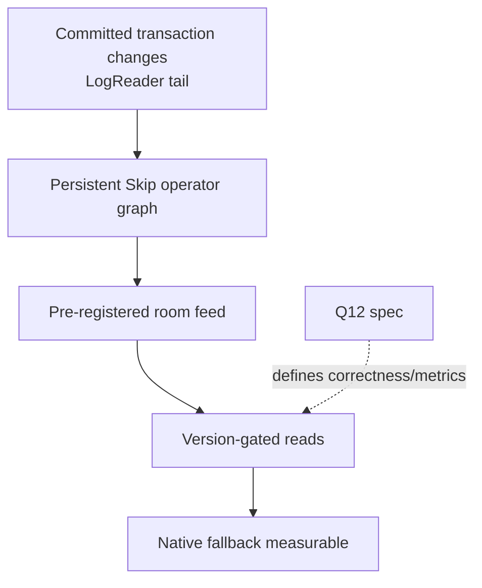

# Skip Direction 2 materialized cache

Skip-side requirements for the backend-owned incremental cache in
`convex-backend/docs/plans/2026-09-10-1702-feat-skip-incremental-materialized-cache-spike-plan.md`.
Anchors below are from `convex-backend/docs/plans/IDENTIFIER-MAP.md`;
unresolved upstream numbers are flagged, never invented.

## Dependencies

## Requirements

- Long-lived incremental graph (maps to
  `sync-protocol-client-atomic-transition-apply` shape, backend-native).
  Generality: generic. Seam: Mapper/Reducer with inverse `remove`
  (precedent `examples/convex_reactive/skip/service.ts:68-87`).
  Accept: one transaction's changes visible atomically at one commit
  version; no per-query torn reads.
- `sync-protocol-client-cross-query-reducer` shape — derived value spans
  tables via reducer, not relay.
  Generality: generic. Accept: join/filter/order/reduce maintained
  incrementally across commits.
- Pre-registered room feed only (membership filter, like reduction,
  `(_creationTime,_id)` order, bounded top-N).
  Generality: convex-only vehicle. Accept: membership/ordering/limit
  match the native oracle definition.
- Version-gated freshness + rebuildable cache (Convex stays source of
  truth; bootstrap/recovery rebuild from consistent state, never publish
  partial).
  Generality: generic pattern, convex-only commit versions.
  Accept: stale reads are checkable against commit order; fallback stays
  measurable (counts, not silence).
- Logical-work instrumentation at each stage (changed-neighborhood
  attribution, asymptotic judgment over absolute thresholds).
  Generality: generic. Accept: scaling report vs strongest native
  baseline (indexes/counters/denormalization).
- `shared-prereqs-q-language-neutral-methodology-spec` reuse —
  settled definition, normalization, counter names implemented natively
  in Rust against Q12, not the TS harness.
  Generality: generic. Accept: same definitions as 1a/1b claims.
- `v.id` join hints with dangling-reference parity (`Unknown`, never
  integrity guarantee; reverse joins need enabled app index).
  Generality: convex-only. Accept: missing targets preserve native
  behavior.

Upstream TODO (blocked): `IDENTIFIER-MAP.md:145-155` notes
`shared-prereqs` cites Direction 2 `R12/R13/R15` + `R13/AE7`, but the
Direction 2 plan defines only R1-R11. This plan cites only resolved
anchors above until upstream corrects either side.

## Non-goals

No planner integration, no OCC/persistence changes, no one-shot
`QueryOperator::Skip` (explicitly rejected for persistent maintenance),
no multi-view generalization, no Skip-specific app APIs.

## Sources

- `convex-backend/docs/plans/IDENTIFIER-MAP.md`
- `convex-backend/docs/plans/2026-09-10-1702-feat-skip-incremental-materialized-cache-spike-plan.md`
- `docs/research/research-dir2-host-requirements.md`
- `docs/research/research-skip-atomic-write-gap.md`
