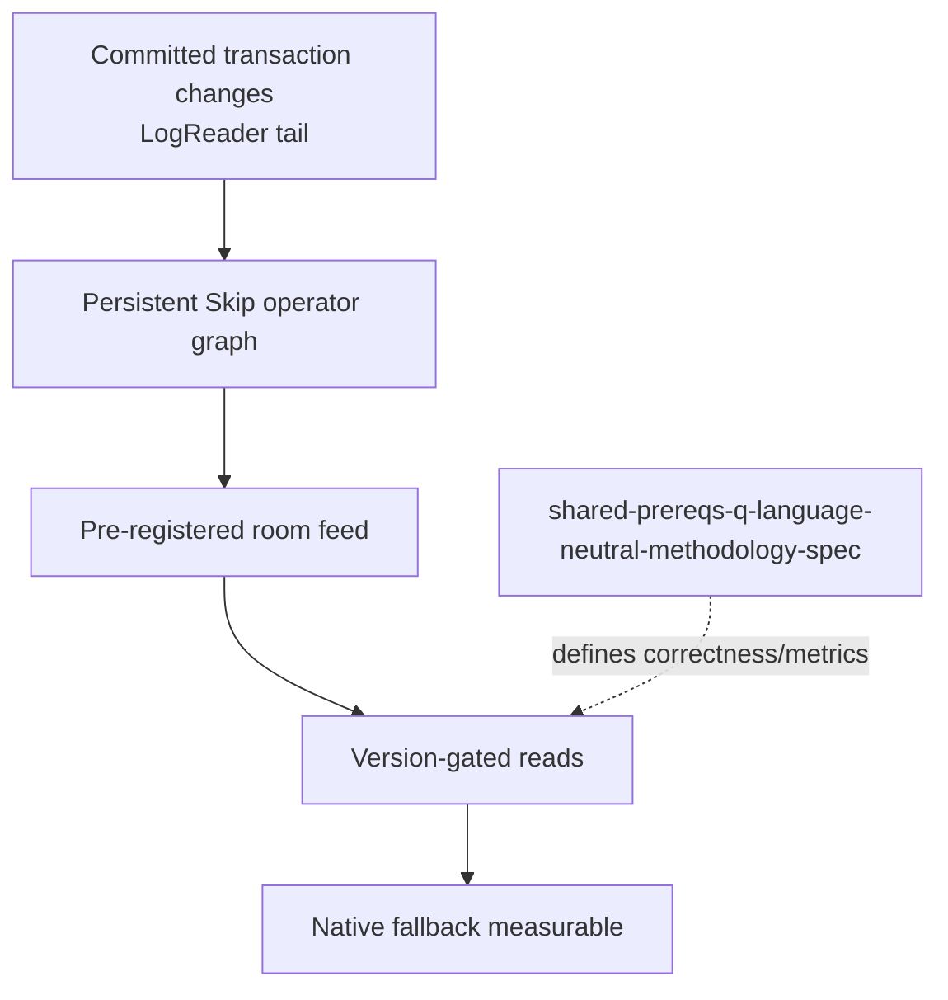

# Skip Direction 2 materialized cache

Skip-side requirements for the backend-owned incremental cache in
`convex-backend/docs/plans/2026-09-10-1702-feat-skip-incremental-materialized-cache-spike-plan.md`.
Anchors below are from `convex-backend/docs/plans/IDENTIFIER-MAP.md`;
unresolved upstream numbers are flagged, never invented.

## Dependencies

## Requirements

- Long-lived incremental graph, backend-native implementation of the
  `shared-prereqs-p-single-fork-per-atomic-unit` shape.
  Generality: generic. Seam: Mapper/Reducer with inverse `remove`
  (precedent `examples/convex_reactive/skip/service.ts:68-87`).
  Accept: one transaction's changes visible atomically at one commit
  version; no per-query torn reads.
- Derived values span tables via reducer, not relay (same shape as
  `sync-protocol-client-cross-query-reducer`, backend-native).
  Generality: generic. Accept: join/filter/order/reduce maintained
  incrementally across commits.
- Pre-registered room feed only (membership filter, like reduction,
  `(_creationTime,_id)` order, bounded top-N).
  Generality: convex-only vehicle. Accept: membership/ordering/limit
  match the native oracle definition.
- `incremental-materialized-cache-accelerated-handshake` — ordinary
  handshake carries experimental acceleration option; app args/values
  stay ordinary Convex values.
  Generality: convex-only. Accept: app surface unchanged.
- Version-gated freshness + rebuildable cache (Convex stays source of
  truth; bootstrap/recovery rebuild from consistent state, never publish
  partial) with `incremental-materialized-cache-fallback-metrics`
  (accelerated/fallback counts, rate/reason, progress vs required
  version, rebuild state, mismatches).
  Generality: generic pattern, convex-only commit versions.
  Accept: required version is the connection's causal sync watermark
  (max observed commit); a healthy behind-view waits only until
  catch-up, read cancel/deadline, or unhealthiness, the latter two
  falling back silently with reason recorded; recovery fence covers a
  change before and a change after the snapshot cursor.
- `incremental-materialized-cache-scaling-instrumentation` at each stage
  plus `incremental-materialized-cache-scaling-report` (vary total size
  and affected fan-out; work/state follow complexity terms).
  Generality: generic. Accept: scaling report vs strongest native
  baseline (indexes/counters/denormalization).
- `incremental-materialized-cache-independent-correctness-check` via
  `shared-prereqs-q-language-neutral-methodology-spec` reuse — settled
  definition, normalization, counter names implemented natively in Rust,
  not the TS harness.
  Generality: generic. Accept: same definitions as 1a/1b claims across
  bootstrap/inserts/updates/deletes/multi-table/restart/lag/recovery.
- `incremental-materialized-cache-dangling-typed-reference` — `v.id`
  join hints with dangling-reference parity (`null` sender, never integrity
  guarantee; reverse joins need enabled app index).
  Generality: convex-only. Accept: missing targets preserve native
  behavior.

## Non-goals

No planner integration, no OCC/persistence changes, no one-shot
`QueryOperator::Skip` (explicitly rejected for persistent maintenance),
no multi-view generalization, no Skip-specific app APIs.

## Sources

- `convex-backend/docs/plans/IDENTIFIER-MAP.md`
- `convex-backend/docs/plans/2026-09-10-1702-feat-skip-incremental-materialized-cache-spike-plan.md`
- `docs/research/research-dir2-host-requirements.md`
- `docs/research/research-skip-atomic-write-gap.md`
