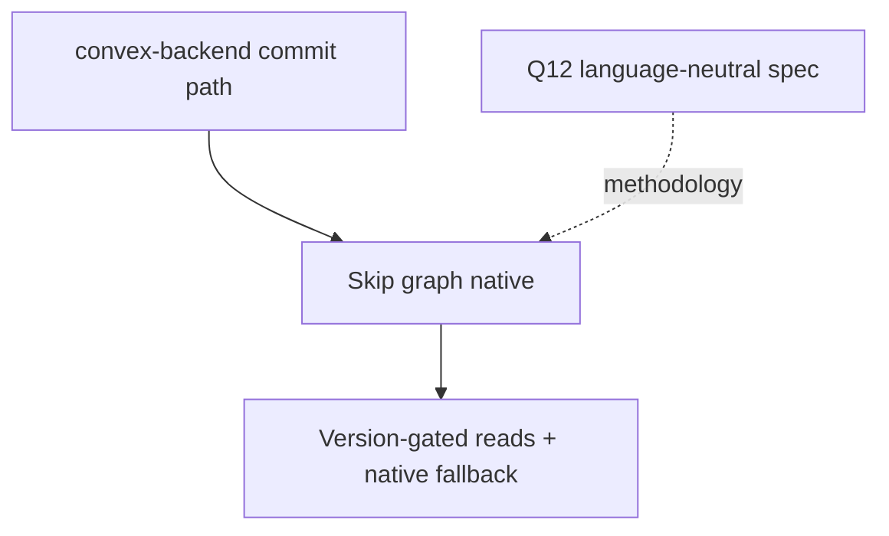

# Skip Direction 2 reference

Lite pointer. Backend owns all implementation in
`convex-backend/docs/plans/2026-09-10-1702-feat-skip-incremental-materialized-cache-spike-plan.md`.
For detail see `2026-09-14-skip-dir2-materialized-cache-plan.md` (full);
no requirement text is duplicated here.

## Dependencies

Skip needs from the host: long-lived Mapper/Reducer graph with inverse
`remove`, `LogReader`-tail grouping, version/health gate with measurable
fallback, logical-work counters, `v.id` edges with `Unknown` parity.
Q12 is the only adoptable shared artifact; P/Q TypeScript code is not
imported.

Blocked upstream: the `R12/R13/R15` citation trio flagged in
`IDENTIFIER-MAP.md:145-155` does not resolve against Direction 2's
R1-R11. Do not invent anchors; cite only resolved rows until upstream
corrects either side.

## Sources

- `convex-backend/docs/plans/IDENTIFIER-MAP.md`
- `docs/research/research-dir2-host-requirements.md`
