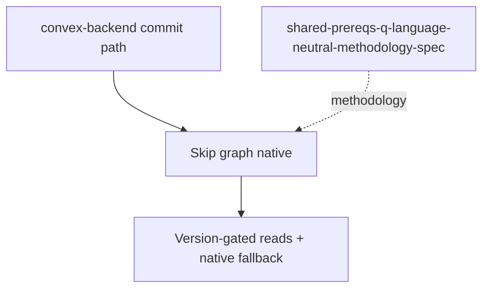

# Skip Direction 2 reference

Lite pointer. Backend owns all implementation in
`convex-backend/docs/plans/2026-09-10-1702-feat-skip-incremental-materialized-cache-spike-plan.md`.
For detail see `2026-09-14-skip-dir2-materialized-cache-plan.md` (full);
no requirement text is duplicated here.

## Dependencies

Skip needs from the host: long-lived Mapper/Reducer graph with inverse
`remove`, `LogReader`-tail grouping, causal-watermark version/health
gate with measurable fallback
(`incremental-materialized-cache-fallback-metrics`),
logical-work counters
(`incremental-materialized-cache-scaling-instrumentation`),
correctness against an independent native result
(`incremental-materialized-cache-independent-correctness-check`),
scaling report
(`incremental-materialized-cache-scaling-report`), `v.id` edges with
`null`-sender parity
(`incremental-materialized-cache-dangling-typed-reference`), handshake
(`incremental-materialized-cache-accelerated-handshake`).
`shared-prereqs-q-language-neutral-methodology-spec` is the only
adoptable shared artifact; P/Q TypeScript code is not imported.
Upstream `IDENTIFIER-MAP.md:135-140` confirms these rows resolve.

## Sources

- `convex-backend/docs/plans/IDENTIFIER-MAP.md`
- `docs/research/research-dir2-host-requirements.md`
