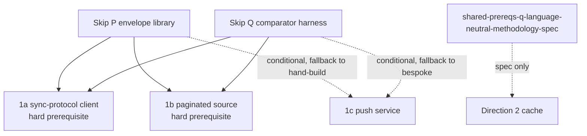

# Skip shared prerequisites

Skip-side build of the P envelope library and Q comparator harness that
`convex-backend/docs/plans/2026-09-11-1159-feat-skip-shared-prerequisites-plan.md`
specifies. All cross-document identifiers below are the descriptive
anchors from `convex-backend/docs/plans/IDENTIFIER-MAP.md` — never bare
numbers. Skip-local additions use `skip-{concept}` slugs defined here.

## Dependencies

1a/1b cannot start implementation until P/Q land. 1c consumes P in
`data-sync-push-u-implement-push-service` and Q in
`data-sync-push-u-retained-graph-comparison-harness`, falling back per
its stop conditions if P/Q are not stable at its verification gate.
Direction 2 imports no TypeScript; it implements natively against
`shared-prereqs-q-language-neutral-methodology-spec`.

Terminology: "vehicle aggregate label" means the frozen PoC vehicle's
two demo aggregates named in
`convex-backend/research/skip-convex-integration/research-poc-vehicle-and-harness.md`:
A1 is the per-user message-count reducer (carries the reducer add/remove
bar), A2 is the joined latest-N feed (carries the join + ordering bar).
They are names for demo outputs scoped to that vehicle — not
cross-document requirement numbers, so they need no `IDENTIFIER-MAP.md`
row. (Graph node ids above read `SP1A/SP1B/SP1C`, not `A1`, for exactly
this reason.)

## P requirements

- `shared-prereqs-p-envelope-type` — one envelope
  `{ts, deleted, component, table, _id, _creationTime, doc}`.
  Generality: generic. Seam: `examples/convex_reactive/shared/model.ts:16-18`,
  `skipruntime-ts/core/src/index.ts:469-533`.
  Accept: producers/consumers share one type, no per-spike fork.
- `shared-prereqs-p-library-surface` — split-mapper, keying
  `<comp>/<table>/<id>` with uniqueness checks, order-key helper.
  Generality: generic. Seam: `examples/convex_reactive/skip/service.ts:34-49`
  split, `:51-111` rejoin.
  Accept: A1 per-user-count / A2 joined latest-N vehicle builds on
  helpers, not hand-rolled keys (vehicle aggregate labels, not
  requirement numbers).
- `shared-prereqs-p-single-fork-per-atomic-unit` — one `writer.update`
  per atomic unit (Transition / revision group / page-group swap).
  Generality: generic. Seam: `core/src/index.ts:476-501` single-collection
  fork/merge, `Runtime.sk:1038-1065` init-vs-patch.
  Accept: multi-table unit lands in one tick; no split per-table calls.
- `shared-prereqs-p-revision-watermark-idempotency` — apply iff
  `entry.ts > retained_ts`; not Skip's session tick.
  Generality: generic. Seam: in-value `ts` field, postgres timestamp
  pass-through precedent `adapters/postgres/src/index.ts:16-18`.
  Accept: replays are idempotent across restarts.
- `shared-prereqs-p-tombstone-gc-policy` — retain per generation,
  discard on resnapshot, sweep past horizon; `[key,[]]` representation.
  Generality: generic. Seam: `Runtime.sk:1038-1065`, `EagerDir.sk:1727`
  `native_eq` short-circuit.
  Accept: deletes propagate once, GC is bounded.
- `shared-prereqs-p-poc-vehicle-demo` — helpers demoed on frozen A1/A2.
  Generality: convex-only (tutorial vehicle).
  Accept: A1 per-user-count reducer + A2 joined latest-N join run on the
  library (vehicle aggregate labels, not requirement numbers).
- `shared-prereqs-p-standalone-test-suite` — split/merge/order/watermark/
  tombstone tests, no transport or Q dependency.
  Generality: generic. Accept: suite passes standalone.
- `shared-prereqs-p-no-runtime-change-required` — no FFI change; batch
  primitive recorded out-of-scope.
  Generality: generic. Accept: statement + gap note, no runtime diff.
- `shared-prereqs-p-generation-fencing-extension` — optional 1c
  extension (staging generation, promotion, pending ledger), matching
  `data-sync-push-ktd-generation-fenced-ingestion` /
  `data-sync-push-ktd-scoped-replay-watermarks`.
  Generality: convex-only (DataSync generations).
  Accept: `data-sync-push-u-implement-push-service` imports or falls
  back; not required for 1a/1b.
- `skip-teardown-serialization` (Skip-local) — serialize setup/teardown
  against the delivery chain; drop late deliveries, do not error.
  Generality: generic. Seam: `adapters/postgres/src/index.ts:45-59`
  `chainInstanceOp`, `adapters/convex/src/index.ts:244-386`.
  Accept: `unsubscribe` mid-setup tears down once ready; no leak.
- `skip-structured-logging-latency` (Skip-local) — structured logger +
  `delivered→applied→published` counters in `@skip-adapter/convex`.
  Generality: generic. Accept: per-delivery timings in tests.

## Q requirements

- `shared-prereqs-q-settled-checkpoint-detector` — version-anchored
  settled predicate. Generality: generic. Accept: checkpoints gate all
  comparisons.
- `shared-prereqs-q-dual-reader-wiring` — Skip SSE vs independent native
  reader, loopback-only. Generality: generic. Accept: no shared code path.
- `shared-prereqs-q-normalized-comparator` — canonical
  `[_creationTime,_id]` sort, `Unknown`-fallback parity, structured
  mismatches. Generality: generic comparator, convex-only parity rule.
  Accept: mismatches locate keys, not bare boolean.
- `shared-prereqs-q-poc-vehicle-driver` — A1 per-user count / A2
  joined latest-N aggregates on frozen vehicle (A1/A2 are vehicle
  aggregate labels from `research-poc-vehicle-and-harness.md`, not
  requirement numbers).
  Generality: convex-only. Accept: both aggregates compared.
- `shared-prereqs-q-counter-timer-catalog` — recorder implementing the
  shared catalog (1a populates only detector/dual-reader/comparator).
  Generality: generic.
  Accept: same names/units across spikes.
- `shared-prereqs-q-fault-injection-fixture` — common faults
  (disconnect, cursor expiry, table replacement, oversized txn, etc).
  Generality: generic fixture, convex-only fault list.
  Accept: 1a/1b/1c subsets run.
- `shared-prereqs-q-fault-assertion-helper` — detect/recover/count
  helpers. Generality: generic. Accept: helpers reused, not rewritten.
- `shared-prereqs-q-self-test-seeded-mismatches` — seeded wrong snapshot
  proves comparator fails loudly. Generality: generic. Accept: self-test
  fails before fix, passes after.
- `shared-prereqs-q-runnable-reference-source` — end-to-end before spikes
  exist. Generality: generic. Accept: runs on PoC vehicle alone.
- `shared-prereqs-q-report-format` — counts/timers/mismatch log consumable
  by spike success criteria. Generality: generic.
- `shared-prereqs-q-schema-matches-1c-jsonl` — field names/units match
  `data-sync-push-ktd-diagnostic-jsonl-schema`.
  Generality: convex-only. Accept: 1c consumes without translation.
- `shared-prereqs-q-language-neutral-methodology-spec` — settled
  definition, normalization, counter names, language-neutral.
  Generality: generic. Accept: Direction 2 implements natively against it.

## Non-goals

No raw `/api/sync` client, no page topology, no SSE endpoint, no
backend-native cache. Those live in the spike plans. No new runtime
batch primitive.

## Sources

- `convex-backend/docs/plans/IDENTIFIER-MAP.md`
- `convex-backend/docs/plans/2026-09-11-1159-feat-skip-shared-prerequisites-plan.md`
- `docs/research/research-shared-PQ-skip-shape.md`,
  `research-skip-atomic-write-gap.md`, `research-convex-adapter-v1.md`,
  `research-postgres-reference.md`
