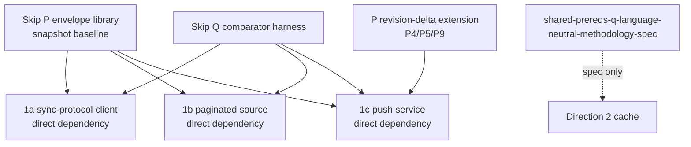

# Skip shared prerequisites

Skip-side build of the P envelope library and Q comparator harness that
`convex-backend/docs/plans/2026-09-11-1159-feat-skip-shared-prerequisites-plan.md`
specifies. All cross-document identifiers below are the descriptive
anchors from `convex-backend/docs/plans/IDENTIFIER-MAP.md` — never bare
numbers. Skip-local additions use `skip-{concept}` slugs defined here.

## Dependencies

1a/1b consume P's snapshot baseline and Q (including the
`shared-prereqs-q-proof-vehicle-fixture` fixture and the
`shared-prereqs-q-no-torn-observer` observer) as direct dependencies
(user decision 2026-09-23); 1a and 1b never wait for the revision-delta
extension. 1c consumes P in
`data-sync-push-u-implement-push-service` (baseline plus the
revision-delta extension for its U4) and Q in
`data-sync-push-u-retained-graph-comparison-harness` (including both
`shared-prereqs-q-fault-injection-fixture` tiers for its U6) as direct
dependencies; a P/Q gap found downstream is escalated and fixed here,
never worked around with a local hand-built or bespoke implementation.
Direction 2 imports no TypeScript; it implements natively against
`shared-prereqs-q-language-neutral-methodology-spec`.

Delivery order: the snapshot baseline (P1-P3, P6-P8) plus Q's
snapshot-path baseline first — it releases 1a and 1b — then the
revision-delta extensions (P4, P5, P9, Q6 revision-delta faults),
validated first against 1c's U4/U6. `skip-teardown-serialization` and
`skip-structured-logging-latency` are follow-ons, not release blockers.

Terminology: upstream commit `676813a47` retired the old A1/A2
two-table aggregate labels as history. The binding vehicle is the shared
five-table proof-vehicle contract (rooms/users/memberships/messages/
likes; `memberships.by_room_user`, `messages.by_room`,
`likes.by_message`; canonical latest-50 room feed with
active-membership filter, nullable sender, per-message `likeCount`).
Where this plan still says "A1/A2" it means that retired history, not a
requirement number. (Graph node ids above read `SP1A/SP1B/SP1C` for
exactly this reason.)

## P requirements

- `shared-prereqs-p-atomic-source-batch-contract` (P1, snapshot
  baseline) — language-neutral batch mapping: source version/order,
  consistency group, delete/replay form, no-torn publication.
  Generality: generic. Seam: one envelope
  `{ts, deleted, component, table, _id, _creationTime, doc}`
  (`examples/convex_reactive/shared/model.ts:16-18`,
  `skipruntime-ts/core/src/index.ts:469-533`).
  Accept: producers/consumers share one type, no per-spike fork; the
  complete group is published once with no subscriber-visible torn
  state. A direction may claim atomicity for a derived feed only after
  `shared-prereqs-q-no-torn-observer` observes the full downstream
  chain.
- `shared-prereqs-p-snapshot-and-revision-encodings` (P2, snapshot
  baseline) — non-interchangeable `SnapshotBatch` and
  `RevisionDeltaBatch` encodings; TypeScript helpers are
  external-source-only, Direction 2 implements natively.
  Generality: generic. Seam: split-mapper, keying
  `<comp>/<table>/<id>` with uniqueness checks, order-key helper
  (`examples/convex_reactive/skip/service.ts:34-49` split, `:51-111`
  rejoin).
  Accept: five-table room-feed vehicle builds on helpers, not
  hand-rolled keys.
- `shared-prereqs-p-external-single-fork-atomicity` (P3, snapshot
  baseline) — one `writer.update` per external consistency group
  (Transition / revision group / page-group swap); snapshot paths write
  complete values, delta paths use tombstones.
  Generality: generic. Seam: `core/src/index.ts:476-501` single-collection
  fork/merge, `Runtime.sk:1038-1065` init-vs-patch.
  Accept: multi-table unit lands in one tick; no split per-table calls.
  This establishes the invariant at the source input only; it does not
  prescribe Direction 2's native publication mechanism.
- `shared-prereqs-p-revision-delta-watermark-idempotency` (P4,
  revision-delta extension, required for 1c U4) — apply iff
  `entry.ts > retained_ts`; not Skip's session tick; cursors advance
  only after the entire group succeeds.
  Generality: generic. Seam: in-value `ts` field, postgres timestamp
  pass-through precedent `adapters/postgres/src/index.ts:16-18`.
  Accept: replays are idempotent across restarts; tombstones cannot be
  resurrected by replay.
- `shared-prereqs-p-tombstone-gc-policy` (P5, revision-delta
  extension, required for 1c U4) — retain per generation,
  discard on resnapshot, sweep past horizon; `[key,[]]` representation.
  Snapshot consumers instead discard replaced complete regions per
  their source lifecycle.
  Generality: generic. Seam: `Runtime.sk:1038-1065`, `EagerDir.sk:1727`
  `native_eq` short-circuit.
  Accept: deletes propagate once, GC is bounded.
- `shared-prereqs-p-poc-vehicle-demo` (P6, snapshot baseline) — helpers demoed on the shared
  five-table room feed: active-membership filtering, nullable-sender
  parity, deterministic latest-50 ordering, per-message `likeCount`
  add/remove correctness, through the envelope convention.
  Generality: convex-only (proof-vehicle contract).
  Accept: canonical feed + `likeCount` run on the library.
- `shared-prereqs-p-standalone-test-suite` (P7, baseline plus
  extension suites) — split/merge/order/reconciliation tests for the
  snapshot baseline; watermark/tombstone/generation-fencing tests for
  the revision-delta extension; no transport or Q dependency.
  Generality: generic. Accept: suites pass standalone.
- `shared-prereqs-p-no-runtime-change-required` (P8, snapshot
  baseline) — no FFI change; batch primitive recorded out-of-scope.
  Generality: generic. Accept: statement + gap note, no runtime diff.
- `shared-prereqs-p-generation-fencing-extension` (P9, revision-delta
  extension, required scope for 1c U4) — staging generation, atomic
  promotion, per-page pending ledger, generation-scoped watermarks,
  matching `data-sync-push-ktd-generation-fenced-ingestion` /
  `data-sync-push-ktd-scoped-replay-watermarks`.
  Generality: convex-only (DataSync generations).
  Accept: 1c's U4 consumes it as a direct dependency; 1a and 1b never
  carry it.
- `skip-teardown-serialization` (Skip-local, follow-on, not a 1a/1b release blocker) — serialize setup/teardown
  against the delivery chain; drop late deliveries, do not error.
  Generality: generic. Seam: `adapters/postgres/src/index.ts:45-59`
  `chainInstanceOp`, `adapters/convex/src/index.ts:244-386`.
  Accept: `unsubscribe` mid-setup tears down once ready; no leak.
- `skip-structured-logging-latency` (Skip-local, follow-on, not a 1a/1b release blocker) — structured logger +
  `delivered→applied→published` counters in `@skip-adapter/convex`.
  Generality: generic. Accept: per-delivery timings in tests.

## Q requirements

- `shared-prereqs-q-settled-checkpoint-detector` — version-anchored
  settled predicate. Generality: generic. Accept: checkpoints gate all
  comparisons.
- `shared-prereqs-q-dual-reader-wiring` — Skip SSE vs independent native
  reader, loopback-only. Generality: generic. Accept: no shared code path.
- `shared-prereqs-q-normalized-comparator` — canonical
  `[_creationTime,_id]` ordering, nullable-sender and exact-`likeCount`
  parity, structured mismatches. Generality: generic comparator,
  convex-only parity rules. Accept: mismatches locate keys, not bare
  boolean.
- `shared-prereqs-q-poc-vehicle-driver` — five tables, required
  application indexes, fixed 50-message room feed, exact output
  projection, independent native reader.
  Generality: convex-only. Accept: canonical feed compared.
- `shared-prereqs-q-counter-timer-catalog` — recorder implementing the
  shared catalog (1a populates only detector/dual-reader/comparator).
  Metric profile per `research-core-metric-profile.md`:
  rows/bytes, atomic batches, changed keys, dependent/reducer work
  required 1b/1c/Dir2 and N-A 1a; stale duration optional 1b / required
  1c/Dir2; mismatch everywhere; fallback Dir2-only. Collision map
  (delivered rows/bytes, keys reconciled, rebuilds, publication, atomic
  unit) plus page/cursor/index-gating extensions.
  Generality: generic.
  Accept: same names/units across spikes.
- `shared-prereqs-q-fault-injection-fixture` (Q6, snapshot-path
  baseline plus revision-delta extension) — two tiers. Baseline (what
  1a/1b gate on): disconnect-before-checkpoint and reconnect,
  `QueryFailed` vs `QueryRemoved` vs not-yet-loaded, multi-table
  transaction in one atomic unit, slow-consumer/bounded-backlog
  exhaustion. Query-state faults apply only to query-subscription
  sources (1a, 1b); 1c's Data Sync source emits document revisions and
  uses only the baseline's disconnect, multi-table, and slow-consumer
  faults. Extension (required for 1c U6, delivered with P's
  revision-delta extension): cursor expiry/invalid/ahead, table
  replacement plus return to snapshotting, oversized transaction beyond
  Data Sync soft limits, Skip-process restart mid-CDC. 1b supplies its
  page-split and invalid-cursor triggers and reuses the baseline's
  stale-retention assertions plus the no-torn observer.
  Fault→state assertions per
  `research-publication-state-semantics.md`: freeze vs blank vs
  not-yet-loaded; never partial-as-current; 1b has no terminal-error
  (stale-window instead), D2 error is counted fallback.
  Generality: generic fixture, convex-only fault list.
  Accept: per-spike subsets run — 1a/1b the baseline, 1c baseline plus
  extension.
- `shared-prereqs-q-fault-assertion-helper` — detect/recover/count
  helpers. Generality: generic. Accept: helpers reused, not rewritten.
- `shared-prereqs-q-self-test-seeded-mismatches` — seeded wrong snapshot
  proves comparator fails loudly, built on shared vectors V1–V6 per
  `research-semantic-test-vectors.md` (dangling sender, membership flip,
  like add/remove, 51-row boundary, deletes, atomic txn) with
  manifest-pinned vector-set version. Generality: generic. Accept:
  self-test fails before fix, passes after.
- `shared-prereqs-q-runnable-reference-source` — end-to-end before spikes
  exist. Generality: generic. Accept: runs on PoC vehicle alone.
- `shared-prereqs-q-report-format` — counts/timers/mismatch log consumable
  by spike success criteria. Generality: generic.
- `shared-prereqs-q-single-metric-schema-authority` (Q11, renamed
  2026-09-23 from `shared-prereqs-q-schema-matches-1c-jsonl`) —
  recorder field names/units come from one authority:
  `research-spike-comparison.md`'s shared counter/timer catalog with
  `research-core-metric-profile.md`'s required/optional/not-applicable
  mapping. 1c's JSONL output (`data-sync-push-ktd-diagnostic-jsonl-schema`,
  produced by its U6 through Q's recorder) must be expressible in that
  schema; no consumer defines metric names of its own.
  Generality: generic catalog, convex-only profile mapping. Accept: 1c
  consumes without translation.
- `shared-prereqs-q-language-neutral-methodology-spec` — settled
  definition, normalization, counter names, language-neutral, plus the
  four checkpoint gates per `research-logical-checkpoint-contract.md`
  (batch applied, result published, oracle observed, freshness
  recorded) with per-direction bindings and failure-exclusion rules
  (failure checkpoints never settled; `SplitRequired`/partial never
  current; post-header failures freeze watermarks; abandoned reads are
  non-comparisons).
  Generality: generic. Accept: Direction 2 implements natively against it.
- `shared-prereqs-q-proof-vehicle-fixture` (Q13, added 2026-09-23) — Q
  owns the app-layer `~/src/convex-tutorial` fixture: rooms,
  memberships, and likes tables with the migrated
  `messages { room, sender, body }` shape, the required application
  indexes, deterministic mutations with acknowledgment data, the
  bounded native-oracle feed query, per-table queries, the monolithic
  baselines, and the versioned V1–V6 corpus loader. 1a, 1b, and 1c's U5
  consume it; Q2, Q4, and Q9 depend on it. Additions a consumer needs
  land as Q13 changes with Q13's own tests, reviewed with Q by the plan
  owner, never as consumer-only fixture commits.
  Generality: convex-only (proof-vehicle contract). Accept: every spike
  consumes this fixture rather than building its own.
- `shared-prereqs-q-no-torn-observer` (Q14, added 2026-09-23) —
  observes every published intermediate Skip-side canonical-feed state
  during a multi-table transaction and asserts none reflects part of an
  atomic group through the full mapper/join/order/reducer chain; first
  proven on Q9's reference run. Each direction reuses it, supplying
  only its atomic group (1a Transition, 1b page-region swap, 1c
  exact-`ts` group); Direction 2 implements the equivalent from the
  methodology spec.
  Generality: generic observer, convex-only vehicle. Accept: live
  no-torn assertions pass per direction.

## Non-goals

No raw `/api/sync` client, no page topology, no SSE endpoint, no
backend-native cache. Those live in the spike plans. No new runtime
batch primitive.

## Sources

- `convex-backend/docs/plans/IDENTIFIER-MAP.md`
- `convex-backend/research/skip-convex-integration/research-core-metric-profile.md`
- `convex-backend/research/skip-convex-integration/research-spike-comparison.md`
- `convex-backend/research/skip-convex-integration/research-logical-checkpoint-contract.md`
- `convex-backend/research/skip-convex-integration/research-publication-state-semantics.md`
- `convex-backend/research/skip-convex-integration/research-semantic-test-vectors.md`
- `convex-backend/docs/plans/2026-09-11-1159-feat-skip-shared-prerequisites-plan.md`
- `docs/research/research-shared-PQ-skip-shape.md`,
  `research-skip-atomic-write-gap.md`, `research-convex-adapter-v1.md`,
  `research-postgres-reference.md`
