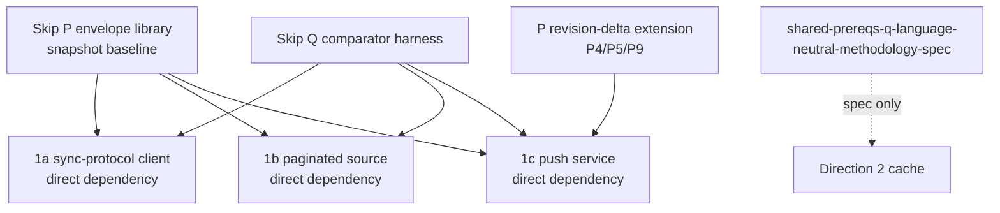

# Skip shared prerequisites

Skip-side build of the P envelope library and Q comparator harness that
`convex-backend/docs/plans/2026-09-11-1159-feat-skip-shared-prerequisites-plan.md`
specifies. All cross-document identifiers below are the descriptive
anchors from `convex-backend/docs/plans/IDENTIFIER-MAP.md` — never bare
numbers. Skip-local additions use `skip-{concept}` slugs defined here.

## Reconciliation (2026-09-23)

Reconciled baseline: this file at commit `a802b744`. The convex-backend
plan is now implementation-ready, and its Planning Contract settles where
this work lives:

- P: workspace package `@skip-adapter/atomic-batch` at
  `skipruntime-ts/adapters/atomic-batch/` (convex-backend plan KTD1).
- Q: private workspace package `skip-convex-proof-harness` at
  `examples/convex_proof_harness/`, an in-process library, not a
  comparator server (KTD2). Its reference service uses `initService`
  with loopback-bound routes that mirror `server/src/rest.ts`, because
  `runService` listens on all interfaces.
- Q13's fixture stays in `convex-tutorial` under `convex/proofVehicle/`
  (KTD3); Q calls it by function name.

Units: `shared-prereqs-u-p-contract-scaffold` (U1) through
`shared-prereqs-u-report-schemas` (U12) are the snapshot
baseline; `shared-prereqs-u-revision-delta-extension` (U13),
`shared-prereqs-u-revision-delta-fault-tier` (U14), and
`shared-prereqs-u-revision-delta-reference-run` (U15) are the
revision-delta tier; `shared-prereqs-u-methodology-spec` (U16,
Q12's METHODOLOGY.md for Direction 2) gates neither tier. Anchors are in
`convex-backend/docs/plans/IDENTIFIER-MAP.md`. Building
`@skipruntime/wasm` (Skiplang toolchain) is a prerequisite for the
runtime-backed units. Skip-local adapter hardening is tracked in
`docs/backlog.md` outside U1-U16.

Implementations: this plan tracks 0..N implementations suitable for
usage. Implementation [0] is the build on convex-backend branch
`billf/prerequisites/sonnet` (U1-U10, U12-U14, U16 done; U11/U15
blocked on live deployment). Further implementations (e.g. generated
with a different model) may be added later; consumers state which
implementation they validate against.

## Dependencies

1a/1b consume P's snapshot baseline and Q (including the
`shared-prereqs-q-proof-vehicle-fixture` fixture and the
`shared-prereqs-q-no-torn-observer` observer) as direct dependencies
(user decision 2026-09-23); 1a and 1b never wait for the revision-delta
extension. 1c consumes P in
`data-sync-push-u-implement-push-service` (baseline plus the
revision-delta extension for its U4) and Q in
`data-sync-push-u-retained-graph-comparison-harness` (including both
`shared-prereqs-q-fault-injection-fixture` tiers for its U6) as direct
dependencies; a P/Q gap found downstream is escalated and fixed here,
never worked around with a local hand-built or bespoke implementation.
Direction 2 imports no TypeScript; it implements natively against
`shared-prereqs-q-language-neutral-methodology-spec`.

Delivery order: the snapshot baseline (`shared-prereqs-p-atomic-source-batch-contract`
(P1) through `shared-prereqs-p-external-single-fork-atomicity` (P3),
plus `shared-prereqs-p-poc-vehicle-demo` (P6) and
`shared-prereqs-p-no-runtime-change-required` (P8), P7
limited to its snapshot-baseline subset) plus Q's snapshot-path
baseline first — it releases 1a and 1b — then the revision-delta
extensions (`shared-prereqs-p-revision-delta-watermark-idempotency`
(P4), `shared-prereqs-p-tombstone-gc-policy` (P5),
`shared-prereqs-p-generation-fencing-extension` (P9), the
`shared-prereqs-p-standalone-test-suite` (P7) extension subset, and the
`shared-prereqs-q-fault-injection-fixture` (Q6) revision-delta faults),
validated first against 1c's U4/U6. Skip-local adapter hardening is
tracked in `docs/backlog.md`, not release-blocking here.
`shared-prereqs-u-methodology-spec` (U16, Q12's METHODOLOGY.md) follows
U12 on its own schedule and gates neither the snapshot-baseline tier
(U1-U12) nor the revision-delta tier (U13-U15).

Consumption map (upstream `billf/prerequisites/sonnet`): 1a/1b may
consume the shipped units now — U1-U2 (contract/encodings), U3-U5
minus live proof (envelope, fixture/loader code; the same-tick
scenario and loader verification ride U11), U6-U10 and U12 (settled
detector, readers, positional comparator, fault assertions, recorder,
schemas, parity — the Q1-Q5/Q7/Q10/Q13 partial slice consumable
before any reference run), U13-U14
(revision-delta code), U16 (METHODOLOGY.md). Still infra-owned: the
U11 snapshot reference run (end-to-end proof releasing 1a/1b) and the
U15 revision-delta run (releasing 1c U4/U6 verification), both needing
the live-deployment infra plan's Definition of Done.

Live-deployment scope: the infra plan's Definition of Done unblocks
U11 only. U15 additionally requires live Data Sync behavior the DoD
does not prove: cursor expiry/invalid/ahead, table replacement with
return to snapshotting, oversized-transaction rejection at the Data
Sync soft limits, and Skip-process restart mid-CDC. 1c U4/U6
verification waits on those, not just the infra DoD.

Terminology: upstream commit `676813a47` retired the old A1/A2
two-table aggregate labels as history. The binding vehicle is the shared
five-table proof-vehicle contract (rooms/users/memberships/messages/
likes; `memberships.by_room_user`, `messages.by_room`,
`likes.by_message`; canonical latest-50 room feed with
active-membership filter, nullable sender, per-message `likeCount`).
Where this plan still says "A1/A2" it means that retired history, not a
requirement number. (Graph node ids above read `SP1A/SP1B/SP1C` for
exactly this reason.)

## P requirements

- `shared-prereqs-p-atomic-source-batch-contract` (P1, snapshot
  baseline) — language-neutral batch mapping: source version/order,
  consistency group, delete/replay form, no-torn publication.
  Generality: generic. Seam: the envelope
  `{ts, deleted, component, table, _id, _creationTime, doc}` is a new
  type owned by `@skip-adapter/atomic-batch` (no shipped precedent:
  `examples/convex_reactive/shared/model.ts:16-18` defines only the
  `WorkspaceRow` key/kind union). Closest row-shape precedent is
  `ConvexSnapshotEntry {key, value}` with `getKey` keying in
  `skipruntime-ts/adapters/convex/src/index.ts:14-43`).
  Accept: producers/consumers share one type, no per-spike fork; the
  complete group is published once with no subscriber-visible torn
  state. A direction may claim atomicity for a derived feed only after
  `shared-prereqs-q-no-torn-observer` observes the full downstream
  chain.
- `shared-prereqs-p-snapshot-and-revision-encodings` (P2, snapshot
  baseline) — non-interchangeable `SnapshotBatch` and
  `RevisionDeltaBatch` encodings; TypeScript helpers are
  external-source-only, Direction 2 implements natively.
  Generality: generic. Seam: real keying precedent is `diffSnapshot`
  in `skipruntime-ts/adapters/convex/src/index.ts:133-163` (`getKey`
  keying, duplicate-key throw, `[key,[]]` tombstones); the
  `<comp>/<table>/<id>` composite keying plus order-key helper are new
  code in the atomic-batch package
  (`examples/convex_reactive/skip/service.ts:34-49` shows only
  kind-split mappers, `:51-111` group-by aggregation).
  Accept: five-table room-feed vehicle builds on helpers, not
  hand-rolled keys.
- `shared-prereqs-p-external-single-fork-atomicity` (P3, snapshot
  baseline) — one `writer.update` per external consistency group
  (Transition / revision group / page-group swap); snapshot paths write
  complete values, delta paths use tombstones.
  Generality: generic. Seam: `core/src/index.ts:476-501` single-collection
  fork/merge, `Runtime.sk:1038-1065` init-vs-patch.
  Accept: one `writer.update` per collection per atomic unit (the
  runtime primitive writes a single collection per call); the
  multi-table unit counts as atomic only when
  `shared-prereqs-q-no-torn-observer` observes the full downstream
  chain with no torn intermediate state. This establishes the
  invariant at the source input only; it does not prescribe Direction
  2's native publication mechanism.
- `shared-prereqs-p-revision-delta-watermark-idempotency` (P4,
  revision-delta extension, required for 1c U4) — apply iff
  `entry.ts > retained_ts`; not Skip's session tick; cursors advance
  only after the entire group succeeds.
  Generality: generic. Seam: in-value `ts` field, postgres timestamp
  pass-through precedent `adapters/postgres/src/index.ts:16-18`.
  Accept: replays are idempotent across restarts; tombstones cannot be
  resurrected by replay.
- `shared-prereqs-p-tombstone-gc-policy` (P5, revision-delta
  extension, required for 1c U4) — retain per generation,
  discard on resnapshot, sweep past horizon; `[key,[]]` representation.
  Snapshot consumers instead discard replaced complete regions per
  their source lifecycle.
  Generality: generic. Seam: `Runtime.sk:1038-1065`, `EagerDir.sk:1727`
  `native_eq` short-circuit.
  Accept: deletes propagate once, GC is bounded.
- `shared-prereqs-p-poc-vehicle-demo` (P6, snapshot baseline) — helpers demoed on the shared
  five-table room feed: active-membership filtering, nullable-sender
  parity, deterministic latest-50 ordering, per-message `likeCount`
  add/remove correctness, through the envelope convention.
  Generality: convex-only (proof-vehicle contract).
  Accept: canonical feed + `likeCount` run on the library.
- `shared-prereqs-p-standalone-test-suite` (P7, separately closable
  per tier) — no transport or Q dependency.
  Generality: generic.
  - Baseline subset (releases 1a/1b): split/merge/order/reconciliation
    tests against synthetic batches. Accept: baseline suite passes
    standalone.
  - Extension subset (releases 1c U4): watermark/tombstone/
    generation-fencing tests. Accept: extension suite passes
    standalone; 1a/1b never wait for it.
- `shared-prereqs-p-no-runtime-change-required` (P8, snapshot
  baseline) — no FFI change; batch primitive recorded out-of-scope.
  Generality: generic. Accept: statement + gap note, no runtime diff.
- `shared-prereqs-p-generation-fencing-extension` (P9, revision-delta
  extension, required scope for 1c U4) — staging generation, atomic
  promotion, per-page pending ledger, generation-scoped watermarks,
  matching `data-sync-push-ktd-generation-fenced-ingestion` /
  `data-sync-push-ktd-scoped-replay-watermarks`.
  Generality: convex-only (DataSync generations).
  Accept: 1c's U4 consumes it as a direct dependency; 1a and 1b never
  carry it.
## Q requirements

- `shared-prereqs-q-settled-checkpoint-detector` (Q1) — version-anchored
  settled predicate. Generality: generic. Accept: checkpoints gate all
  comparisons.
- `shared-prereqs-q-dual-reader-wiring` (Q2) — Skip SSE vs independent native
  reader, loopback-only. Generality: generic. Accept: no shared code path.
- `shared-prereqs-q-normalized-comparator` (Q3) — positional comparison
  with per-field canonicalization only: nullable-sender and
  exact-`likeCount` representation parity, structured mismatches. The
  comparator never re-sorts either side; producing the correct
  descending `[_creationTime,_id]` order is each side's own
  responsibility, and a swapped tie surfaces as a positional mismatch.
  Generality: generic comparator,
  convex-only parity rules. Accept: mismatches locate keys, not bare
  boolean.
- `shared-prereqs-q-poc-vehicle-driver` (Q4) — five tables, required
  application indexes, fixed 50-message room feed, exact output
  projection, independent native reader.
  Generality: convex-only. Accept: canonical feed compared.
- `shared-prereqs-q-counter-timer-catalog` (Q5) — recorder implementing the
  shared catalog (1a populates only detector/dual-reader/comparator).
  Metric profile per `research-core-metric-profile.md`:
  rows/bytes, atomic batches, changed keys, dependent/reducer work
  required 1b/1c/Dir2 and N-A 1a; stale duration optional 1b / required
  1c/Dir2; mismatch everywhere; fallback Dir2-only. Collision map
  (delivered rows/bytes, keys reconciled, rebuilds, publication, atomic
  unit) plus page/cursor/index-gating extensions.
  Generality: generic.
  Accept: same names/units across spikes.
- `shared-prereqs-q-fault-injection-fixture` (Q6, snapshot-path
  baseline plus revision-delta extension) — two tiers. Baseline (what
  1a/1b gate on): disconnect-before-checkpoint and reconnect,
  `QueryFailed` vs `QueryRemoved` vs not-yet-loaded, multi-table
  transaction in one atomic unit, slow-consumer/bounded-backlog
  exhaustion. Query-state faults apply only to query-subscription
  sources (1a, 1b); 1c's Data Sync source emits document revisions and
  uses only the baseline's disconnect, multi-table, and slow-consumer
  faults. Extension (required for 1c U6, delivered with P's
  revision-delta extension): cursor expiry/invalid/ahead, table
  replacement plus return to snapshotting, oversized transaction beyond
  Data Sync soft limits, Skip-process restart mid-CDC. 1b supplies its
  page-split and invalid-cursor triggers and reuses the baseline's
  stale-retention assertions plus the no-torn observer.
  Fault→state assertions per
  `research-publication-state-semantics.md`: freeze vs blank vs
  not-yet-loaded; never partial-as-current; 1b has no terminal-error
  (stale-window instead), D2 error is counted fallback.
  Generality: generic fixture, convex-only fault list.
  Accept (separately closable per tier): baseline tier proven on the
  minimal reference source alone — releases 1a/1b; extension tier
  proven against 1c's U6 Data Sync triggers — releases 1c U4/U6
  verification. 1a/1b never wait for the extension tier.
- `shared-prereqs-q-fault-assertion-helper` (Q7) — detect/recover/count
  helpers. Generality: generic. Accept: helpers reused, not rewritten.
- `shared-prereqs-q-self-test-seeded-mismatches` (Q8) — seeded wrong snapshot
  proves comparator fails loudly, built on shared vectors V1–V6 per
  `research-semantic-test-vectors.md` (dangling sender, membership flip,
  like add/remove, 51-row boundary, deletes, atomic txn) with
  manifest-pinned vector-set version. Generality: generic. Accept:
  self-test fails before fix, passes after.
- `shared-prereqs-q-runnable-reference-source` (Q9) — end-to-end before spikes
  exist. Generality: generic. Prerequisites: a live local Convex
  deployment and a built Skip runtime, per the Definition of Done of
  `convex-backend/docs/plans/2026-09-26-1245-chore-skip-local-convex-dev-infra-plan.md`
  (carries upstream U11). Accept: runs on PoC vehicle alone once those
  hold.
- `shared-prereqs-q-report-format` (Q10) — counts/timers/mismatch log consumable
  by spike success criteria. Generality: generic.
- `shared-prereqs-q-single-metric-schema-authority` (Q11, renamed
  2026-09-23 from `shared-prereqs-q-schema-matches-1c-jsonl`) —
  recorder field names/units come from one authority:
  `research-spike-comparison.md`'s shared counter/timer catalog with
  `research-core-metric-profile.md`'s required/optional/not-applicable
  mapping. 1c's JSONL output (`data-sync-push-ktd-diagnostic-jsonl-schema`,
  produced by its U6 through Q's recorder) must be expressible in that
  schema; no consumer defines metric names of its own.
  Generality: generic catalog, convex-only profile mapping. Accept: 1c
  consumes without translation.
- `shared-prereqs-q-language-neutral-methodology-spec` (Q12) — settled
  definition, normalization, counter names, language-neutral, plus the
  four checkpoint gates per `research-logical-checkpoint-contract.md`
  (batch applied, result published, oracle observed, freshness
  recorded) with per-direction bindings and failure-exclusion rules
  (failure checkpoints never settled; `SplitRequired`/partial never
  current; post-header failures freeze watermarks; abandoned reads are
  non-comparisons).
  Generality: generic. Accept: Direction 2 implements natively against it.
  Adoption check: one Direction-2 implementer trial build or written
  sign-off that the spec alone sufficed, before the Direction-2 goal
  counts as served.
- `shared-prereqs-q-proof-vehicle-fixture` (Q13, added 2026-09-23) — Q
  owns the app-layer `~/src/convex-tutorial` fixture: rooms,
  memberships, and likes tables with the migrated
  `messages { room, sender, body }` shape, the required application
  indexes, deterministic mutations with acknowledgment data, the
  bounded native-oracle feed query, per-table queries, the monolithic
  baselines, and the versioned V1–V6 corpus loader. 1a, 1b, and 1c's U5
  consume it; Q2, Q4, and Q9 depend on it. Additions a consumer needs
  land as Q13 changes with Q13's own tests, reviewed with Q by the plan
  owner, never as consumer-only fixture commits.
  Cross-repo coupling is versioned upstream (KTD3/U4): function-name
  list, `allSelectedRows` row-shape version, corpus
  `fixtureSetVersion`, loader CLI JSON shape. U8 and U11 fail fast on
  a version mismatch before any comparison, and the vendored corpus
  copy is checked by semantic hash. 1a/1b/1c runs must cite the
  contract version they validate against.
  Generality: convex-only (proof-vehicle contract). Accept: every spike
  consumes this fixture rather than building its own.
- `shared-prereqs-q-no-torn-observer` (Q14, added 2026-09-23) —
  observes every published intermediate Skip-side canonical-feed state
  during a multi-table transaction and asserts none reflects part of an
  atomic group through the full mapper/join/order/reducer chain; first
  proven on Q9's reference run. Each direction reuses it, supplying
  only its atomic group (1a Transition, 1b page-region swap, 1c
  exact-`ts` group); Direction 2 implements the equivalent from the
  methodology spec. For V6 the observer watches a `groupProbe` resource
  (`{active, likeCount}` per message, before the membership filter)
  alongside the feed, because a membership-first tear already equals the
  feed's final empty output; both write orders must be detectable
  (`shared-prereqs-u-no-torn-observer`).
  Generality: generic observer, convex-only vehicle. Accept: live
  no-torn assertions pass per direction.

## Non-goals

No raw `/api/sync` client, no page topology, no SSE endpoint, no
backend-native cache. Those live in the spike plans. No new runtime
batch primitive.

## Deferred / Open Questions

### From 2026-09-24 review

- **Hard direct dependency with no slip rule deadlocks all three spikes** — Dependencies (direct-dependency / never-worked-around rule) (P0, adversarial + product-lens, confidence 100)

  If the shared envelope library or comparator harness slips, is wrong, or the wasm toolchain blocks runtime-backed units, the three spike teams have no legal move: they must wait and may not hand-build. The plan states the release dependency but never the escape condition, turning shared infrastructure into a single point of schedule failure.

- **One envelope invariant spans four incompatible atomicity regimes** — P requirements (batch contract P1 / encodings P2) (P1, adversarial, confidence 75)

  A Transition version (sync-protocol client), a page-region swap publication group (paginated source, explicitly not its transport Transition), an exact-timestamp revision group with cursors (push service), and a commit version with causal watermark (Direction 2) do not share versioning, ordering, deletion, or replay semantics. One contract over them risks passing unit tests that fail on first real-consumer integration.

- **"Structurally one problem" is asserted as scheduling decision, not warranted premise** — Reconciliation (P1, adversarial, confidence 75)

  The shared-build case rests on similar planning-text gaps while the evidence shows divergence: the push service already solved both halves independently, snapshot and revision-delta encodings are non-interchangeable, fault tiers are disjoint by transport, and Direction 2 cannot import code. There is no stated condition under which sharing would be judged to have cost more than hand-building.

- **Q13 fixture ownership plus Q14 observer bloat the 1a/1b release gate** — Q requirements (proof-vehicle fixture Q13 / no-torn observer Q14) (P1, adversarial, confidence 75)

  Releasing the baseline also requires building and owning the full five-table app fixture plus a live every-intermediate-state observer with a mandatory sidecar resource, all under single-owner change control that forbids consumer-only fixture commits. A tutorial migration or loader parity snag blocks the spike teams even though settled-checkpoint comparison alone would unblock them.

- **"Releases 1a/1b" has no entry criteria — fast-unblock goal is untestable** — Dependencies / Delivery order (P1, product-lens, confidence 75)

  The spike teams cannot know when they may actually start, so the central promise that the baseline unblocks them fast cannot be verified or scheduled against. Teams will either ship too much before declaring release or declare release while consumers are still blocked.

- **Q baseline is untiered, so 1c/Direction-2-only work can block the 1a/1b fast path** — Q requirements / Delivery order (P1, product-lens, confidence 75)

  Only the fault fixture is explicitly split into baseline-plus-extension, while the metric-schema authority, the language-neutral methodology spec, and other harness items carry no tier. Readers must assume all of the comparator harness gates the release, including work serving only the push service or the Direction-2 cache.

### From 2026-09-28 review

- **Concurrent spike teams contend for single-owner Q13 change control** — Q requirements (proof-vehicle fixture Q13) / Dependencies (P1, adversarial + product-lens, confidence 75)

  Every consumer-needed fixture addition must land as a Q13 change with Q13's own tests reviewed by the plan owner, with no consumer-only commits, while any P/Q gap must be escalated and fixed centrally, never worked around. Three concurrently starting consumers contend for one owner's review bandwidth with no version-branch, revert-ownership, triage-SLA, or time-boxed unblock rule. (Remedies considered: version-gated additions with per-consumer revalidation owners vs triage SLA/deputy plus time-boxed local unblock.)

## Sources

- `convex-backend/docs/plans/IDENTIFIER-MAP.md`
- `convex-backend/research/skip-convex-integration/research-core-metric-profile.md`
- `convex-backend/research/skip-convex-integration/research-spike-comparison.md`
- `convex-backend/research/skip-convex-integration/research-logical-checkpoint-contract.md`
- `convex-backend/research/skip-convex-integration/research-publication-state-semantics.md`
- `convex-backend/research/skip-convex-integration/research-semantic-test-vectors.md`
- `convex-backend/docs/plans/2026-09-11-1159-feat-skip-shared-prerequisites-plan.md`
- `docs/research/research-shared-PQ-skip-shape.md`,
  `research-skip-atomic-write-gap.md`, `research-convex-adapter-v1.md`,
  `research-postgres-reference.md`
