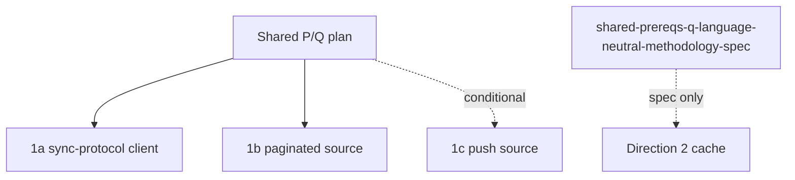

# Skip spike references

Weak, index-only pointers for 1a/1b/1c. No requirements are defined
here; each bullet links the convex-backend plan, the Skip research
note, the P/Q anchors consumed, and the Skip seam. If a spike needs
detail, it gets its own plan; this file never copies requirement text.

## Dependencies

## 1a sync-protocol client

- Plan: `convex-backend/docs/plans/2026-09-10-1509-feat-skip-sync-protocol-client-plan.md`.
- Research: `docs/research/research-1a-skip-mapping.md`.
- Consumes: `shared-prereqs-p-single-fork-per-atomic-unit` per
  `sync-protocol-client-atomic-transition-apply`;
  `shared-prereqs-q-settled-checkpoint-detector`,
  `shared-prereqs-q-dual-reader-wiring`,
  `shared-prereqs-q-normalized-comparator` for
  `sync-protocol-client-settled-checkpoint-comparator`;
  `sync-protocol-client-cross-query-reducer` for the genuine-computation
  bar (`sync-protocol-client-first-attempt-failure` acceptance).
- Seam: reassemble Transition/TransitionChunk, one `isInit:true` write,
  no bridge diff (`Runtime.sk:1038-1065`, `EagerDir.sk:1727`).

## 1b paginated source

- Plan: `convex-backend/docs/plans/2026-09-10-1843-feat-skip-paginated-reactive-source-spike-plan.md`.
- Research: `docs/research/research-1b-page-regions.md`.
- Consumes: P envelope + single-fork rule for
  `paginated-reactive-source-bounded-prefix-load` page-group swaps;
  Q detector/comparator/recorder for
  `paginated-reactive-source-disjoint-page-merge` settled checks.
- Seam: pages as separate input regions, disjoint-ID assert,
  `[_creationTime,_id]` order, reducer with inverse `remove`.

## 1c push source

- Plan: `convex-backend/docs/plans/2026-09-10-1854-feat-skip-data-sync-push-source-spike-plan.md`
  (`data-sync-push-u-implement-push-service`,
  `data-sync-push-u-retained-graph-comparison-harness`).
- Research: `docs/research/research-1c-push-contract.md`.
- Consumes (conditional): `shared-prereqs-p-generation-fencing-extension`
  for `data-sync-push-ktd-generation-fenced-ingestion`,
  `shared-prereqs-p-library-surface` for
  `data-sync-push-ktd-single-collection-tagged-keys`,
  `shared-prereqs-p-revision-watermark-idempotency` /
  `shared-prereqs-p-tombstone-gc-policy` for
  `data-sync-push-ktd-scoped-replay-watermarks`;
  `shared-prereqs-q-schema-matches-1c-jsonl` generalizes
  `data-sync-push-ktd-diagnostic-jsonl-schema`.
- Seam: custom push `ExternalService`, one atomic batch per
  `data-sync-push-atomic-revision-group-apply`, cursor-after-apply.

## Sources

- `convex-backend/docs/plans/IDENTIFIER-MAP.md`
- `docs/research/research-1a-skip-mapping.md`,
  `research-1b-page-regions.md`, `research-1c-push-contract.md`
