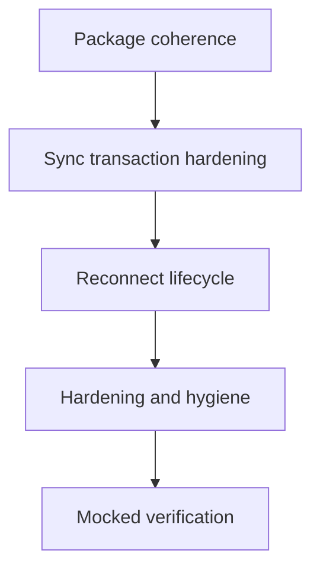

## Goal Capsule

- **Objective:** The Convex restack lands with no incoherent intermediate tip, no silent data divergence, and no leaked stream instances, verified by mocked unit and integration coverage.
- **Means:** Fold the recovery repair into the package introduction and harden the sync and reconnect paths in dependency order (KTD1, KTD2).
- **Authority:** Current review findings and verified tip state are authoritative; the open PR diffs are the change surface.
- **Stop conditions:** All units land behind the same branch chain with the Verification Contract satisfied and abandoned-attempt code removed.
- **Execution profile:** Code change across adapter package and two examples plus repo hygiene, with test-first proof on the transaction and reconnect units.
- **Who finishes:** Implementer plus reviewer; implementer runs the Verification Contract before requesting review.

---

## Product Contract

### Summary

This plan fixes the review findings so the package tip is coherent at every step, committed batches never outrun the collection, reconnects clean up and retry, and small hardening and hygiene items land together.

### Problem Frame

The review found one incoherent intermediate tip where the shared package regressed bounded recovery and ownership, plus open client defects where a swallowed commit receipt lets the mirror advance past the collection and where reconnects orphan server instances and retry only once. Small guards and repo hygiene gaps ride along. Without this pass the stack can land broken in the middle or serve stale data silently at the tip.

### Requirements

**Package coherence**

- R1. The shared adapter package introduces bounded recovery and caller-owned client handling from its first appearance.
- R2. No intermediate tip reintroduces an uncapped hot loop or terminal bootstrap rejection.

**Sync correctness**

- R3. The TanStack collection advances its mirror and readiness only after a batch is committed.
- R4. A failed write or commit leaves no stranded transaction for the next event.

**Reconnect lifecycle**

- R5. Reconnecting discards the dead stream identifier on the server before minting a replacement.
- R6. A failed reconnect retries with backoff and surfaces a visible state instead of serving stale rows silently.

**Hardening and hygiene**

- R7. Recovery timers and numeric options fail safe outside Node and on invalid input.
- R8. Generated-file attributes collapse pnpm lockfiles and generated trees in review diffs (npm basename matching already collapses nested package-lock.json).
- R9. Moved documentation paths resolve in the coordination repo and overclaims are corrected.

**Teardown and recovery robustness**

- R10. Pending subscribe settles on teardown, and bootstrap exhaustion through the full cap is covered.
- R11. Transport-error vs consumer-rejection recovery policy is documented, backoff is bounded, and each recovery advances generation once.

**Example correctness and close-out**

- R12. Example stream parsing validates entries before mutating UI or collection state.
- R13. Stale pre-restack PRs are closed out and example sequencing nits are resolved.

### Scope Boundaries

- Covers the package tip, both example clients, and the hygiene items named in R8 and R9.
- Out of scope: landing or merging the restack PRs, rewriting published history, and live Convex deployment provisioning.
- Deferred to follow-up work: live Skip and Convex end-to-end runs beyond mocked integration, and TanStack pre-ready terminal semantics if docs prove the current behavior intended.

---

## Planning Contract

### Key Technical Decisions

- KTD1. Fold the recovery repair into the package introduction rather than landing them as ordered steps, because an intermediate tip with uncapped recovery is unreleasable even briefly.
- KTD2. Fix the shared package first and re-sync the examples from it, because two hand-kept copies caused the earlier divergence.
- KTD3. Prove the transaction and reconnect units test-first with mocked sync params and fetch, because the defects are race and failure paths that inspection alone cannot lock in.
- KTD4. Keep live-service reproduction as deferred verification, because mocked integration proves the invariants without flaky infrastructure.

### High-Level Technical Design

The pass runs in dependency order from package coherence outward to clients, then hygiene. Directional guidance only, not implementation specification.

### Assumptions

- The restack branch chain remains linear and rebasable during the fix-up.
- TanStack sync params expose a way to observe commit receipt rejection and to avoid nesting on a dirty transaction.
- Mocked fetch and EventSource doubles are sufficient to prove reconnect cleanup and retry.

### Sequencing

Work proceeds U1 through U5 in order. U2 depends on U1. U3 depends on U2. U4 and U5 follow once client behavior is stable.

---

## Implementation Units

### U1. Package tip coherence

**Goal:** Make the shared package introduction coherent on its own.

**Requirements:** R1, R2, R10, R11.

**Dependencies:** None.

**Files:**

- skipruntime-ts/adapters/convex/src/index.ts
- skipruntime-ts/adapters/convex/src/index.test.ts
- skipruntime-ts/adapters/convex/package.json
- skipruntime-ts/adapters/convex/README.md
- examples/convex_reactive/DESIGN.md

**Approach:**

- Carry the bounded recovery, ownership, scope freeze, and bootstrap retry behavior into the package introduction.
- Remove the per-example adapter copies or re-export them from the package per KTD2.
- Correct the registration claim to match what the diff actually touches.
- Settle pending subscribe on release (reject initial when unsettled) so unsubscribe-before-push cannot hang.
- Bound backoff delay and advance generation once per recovery.
- Document the transport-fatal vs consumer-retriable policy in the adapter README Recovery section (or unify the paths).

**Patterns to follow:** Existing bounded recovery shape at the current tip, including capped attempts with backoff and generation fencing.

**Test scenarios:**

- Persistently rejecting consumer stops after the configured cap and goes inert with an error callback.
- Poison row redelivered from cache does not saturate the event loop.
- Injected client survives shutdown of one service while a second service keeps delivering.
- Bootstrap rejection retries instead of rejecting the subscribe call.
- Package tests cover cap, ownership, bootstrap retry, and replay behavior.
- Unsubscribe before first push rejects the pending subscribe and removes the instance without hanging.
- Bootstrap failing through the full cap rejects pending, marks the instance inert, and cleans up.
- Concurrent double-subscribe fails cleanly and teardown during backoff clears the timer with no reattach.

**Verification:** Package unit suite passes and the intermediate tip shows bounded recovery and ownership handling present.

### U2. Sync transaction hardening

**Goal:** Keep the collection mirror from outrunning committed state.

**Requirements:** R3, R4, R12.

**Dependencies:** U1.

**Files:**

- examples/convex_tanstack/src/skip_collection.ts
- examples/convex_tanstack/skip/service.test.ts
- examples/convex_tanstack/src/skip_collection.test.ts

**Approach:**

- Execution note: Add failing mocked-sync tests for receipt rejection and write failure before changing behavior.
- Advance the mirror and readiness only on settled-commit success per KTD3.
- Ensure a write or commit throw leaves the transaction in a clean state for the next event.
- Validate entries before mutating collection state so poison entries cannot reach the write path.

**Patterns to follow:** Existing staged-validation-before-begin shape, extended to cover the commit settlement path.

**Test scenarios:**

- Commit receipt rejection leaves the mirror unchanged and readiness unfired while the error surfaces.
- Malformed batch never opens a transaction.
- Throwing write leaves the next event able to begin cleanly.
- Rapid out-of-order events converge the collection to the final snapshot.
- Poison entry is rejected before collection mutation with the error surfaced.

**Verification:** New mocked-sync tests fail before and pass after, with no stranded-transaction warnings.

### U3. Reconnect lifecycle repair

**Goal:** Stop leaking stream instances and stop single-shot retries.

**Requirements:** R5, R6.

**Dependencies:** U1, U2.

**Files:**

- examples/convex_reactive/src/skip_stream.ts
- examples/convex_tanstack/src/skip_collection.ts
- examples/convex_reactive/src/skip_stream.test.ts
- examples/convex_tanstack/src/skip_collection.test.ts

**Approach:**

- Capture and delete the superseded stream identifier during reconnect.
- Replace the fixed single retry with bounded backoff and jitter, resetting on successful init.
- Separate reconnecting indication from terminal error so valid rows do not flash error UI.

**Test scenarios:**

- Closed socket triggers deletion of the old identifier before minting a replacement.
- First reconnect failure schedules a second attempt with growing delay.
- Repeated failures reach a terminal surfaced error after the bound.
- Dispose during pending retry issues no further connects and still cleans up.
- Post-ready drops keep serving rows with a visible reconnecting state rather than silent staleness.

**Verification:** Fetch-mock tests prove deletion, retry, bound, and dispose behavior in both examples.

### U4. Adapter and example hardening

**Goal:** Remove fail-unsafe guards and small example defects.

**Requirements:** R7, R11, R12, R13.

**Dependencies:** U3.

**Files:**

- skipruntime-ts/adapters/convex/src/index.ts
- examples/convex_tanstack/src/routes/index.tsx
- examples/convex_tanstack/vite.config.ts
- examples/convex_reactive/src/skip_stream.ts
- examples/convex_reactive/convex/workspace.ts

**Approach:**

- Guard the recovery timer for non-Node runtimes and validate numeric options at construction.
- Restore the collection type predicate, remove the nonstandard bundler option, and confirm write-path parity intent.
- Keep transient stream error handling from latching permanently and validate direct mutations.
- Validate entries before the setRows updater so poison entries cannot escape the receive catch.
- Resolve sequencing nits: root README pointer coverage if early PRs merge alone, test glob scope, hooks-in-literals, and silent-accept graph inputs.

**Test scenarios:**

- Recovery path runs without a timer handle extension point in a browser-like double.
- Non-finite attempts or backoff values are rejected at construction.
- Collection passes type checking under real Convex codegen types.
- Transient drop followed by delivery clears the error indication.
- Direct mutation with empty or out-of-range input is rejected.
- Poison entry is rejected before state mutation with the error surfaced.
- Review verifies README pointer, test glob, hooks, and graph-input handling.

**Verification:** Type checking under real codegen plus unit coverage for the guards passes.

### U5. Repo hygiene and docs correction

**Goal:** Make generated diffs collapse and moved docs resolve.

**Requirements:** R8, R9, R13.

**Dependencies:** U4.

**Files:**

- .gitattributes
- docs/skip/plans/2026-09-14-skip-shared-prerequisites-plan.md
- docs/skip/plans/2026-09-26-convex-restack-plan.md
- docs/skip/research/research-dir2-skip-evidence.md
- docs/skip/research/README.md
- docs/skip/research/convex-adapter-metrics-review.json
- docs/README.md
- examples/convex_reactive/DESIGN.md

**Approach:**

- Add pnpm-lock.yaml generated pattern and document the pnpm decision (nested npm lockfiles already collapse via basename matching).
- Rewrite stale relative and machine paths to coordination-repo locations and re-anchor line references to the current pins, including restack-plan shorthands and the docs index.
- Close out stale pre-restack PRs #1 and #2 as hygiene (no code change).

**Test expectation:** none -- pure config and prose with review-based verification.

**Verification:** Attribute checks collapse nested lockfiles and a docs pass finds no stale relative paths or dead absolute references.

---

## Verification Contract

| Check | Applies to | Done signal |
|---|---|---|
| Adapter package unit suite | U1, U4 | Bounded recovery, ownership, bootstrap, replay, teardown-settlement, and exhaustion cases pass |
| Example mocked sync and stream suites | U2, U3 | Receipt, transaction, deletion, retry, bound, dispose, and poison-entry cases pass |
| Type checking under real Convex codegen | U2, U4 | Collection and service compile without any-type masking |
| Attribute and docs review | U5 | Pnpm lockfiles collapse and moved paths resolve |

---

## Definition of Done

- Global: every unit satisfies its verification, no incoherent intermediate tip remains, and abandoned-attempt code is removed from the diff.
- U1: package introduction is coherent standalone with full replay, ownership, teardown-settlement, and exhaustion coverage.
- U2: mirror and readiness advance only on committed batches with no stranded transactions.
- U3: reconnects delete the old identifier, retry with backoff to a bound, and surface state honestly.
- U4: guards fail safe, poison entries are rejected before mutation, and example nits are resolved or explicitly accepted.
- U5: attributes and docs pass review with no stale paths, and stale PRs are closed out.

---

## Appendix

- Review source: prior swarm findings covering PRs 5 through 13 and 15 through 18, plus moved-docs and submission checks.
- Packs: resolver returned no packs; search root was the local solutions tree alone.
- External research: skipped; local adapter, sync, and reconnect patterns plus review evidence were sufficient.
